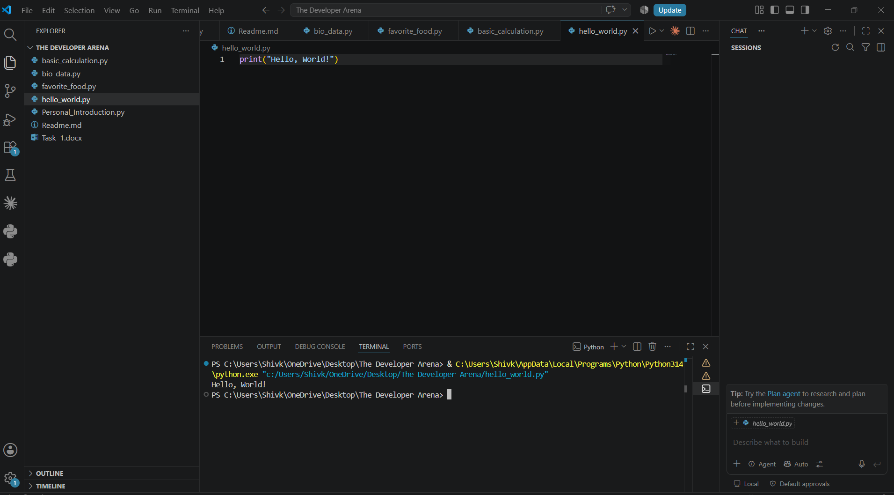
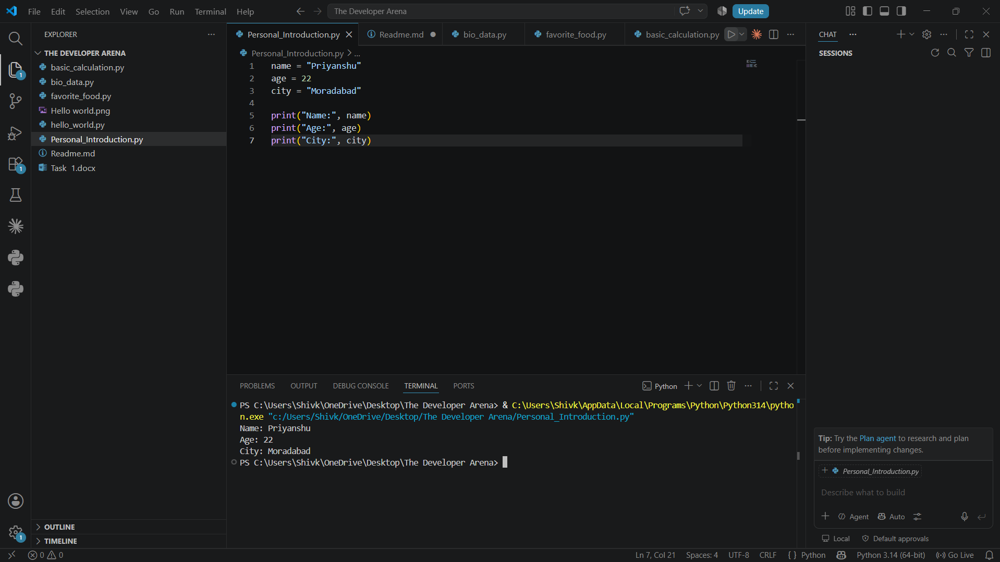
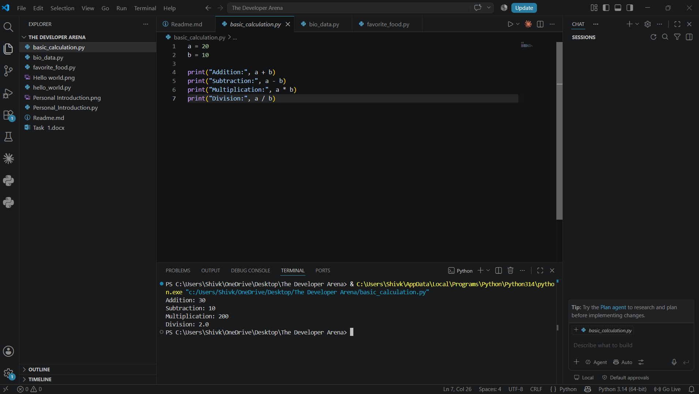
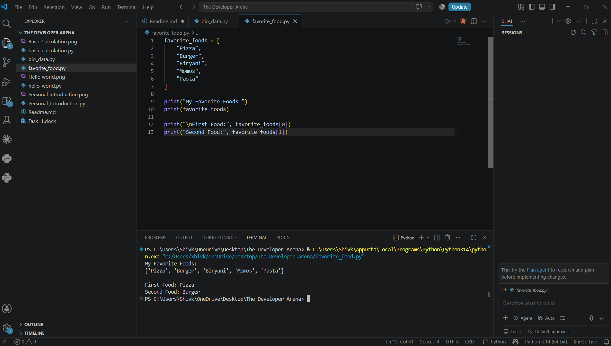

# 🐍 Python Basics — Beginner Practice Projects

A beginner-friendly Python project designed to build a strong foundation in programming through simple, practical exercises.

This repository covers the fundamentals of Python, including **Python installation, variables, basic calculations, lists, string handling, and displaying personal information**.

The exercises are designed for beginners who are taking their first steps into programming and want to understand how Python code works step by step.

---

## 📌 Learning Objectives

By completing this project, you will learn how to:

* Install and configure Python on your computer
* Write and execute your first Python program
* Understand variables and different types of data
* Store and display personal information
* Perform basic mathematical calculations
* Create and access Python lists
* Work with strings and formatted output
* Build a simple real-world Python program
* Run Python programs using the terminal or VS Code

---

## 📂 Project Structure

```text
Python-Basics/
│
├── 01_hello_world.py
├── 02_personal_information.py
├── 03_basic_calculations.py
├── 04_favorite_foods.py
├── 05_bio_data.py
│
├── screenshots/
│   ├── hello-world.png
│   ├── variables.png
│   ├── calculations.png
│   ├── favorite-foods.png
│   └── bio-data.png
│
└── README.md
```

---

# 🚀 Exercises

## 1. Install Python

First, install Python on your operating system.

Download Python from the official website:

**https://www.python.org/**

After installation, verify that Python is installed correctly by opening a terminal or command prompt and running:

```bash
python --version
```

or:

```bash
python3 --version
```

If Python is installed successfully, the terminal will display the installed Python version.

### Example

```text
Python 3.x.x
```

---

# 2. Hello World Program

The first program introduces the basic structure of Python programming.

### Code

```python
print("Hello, World!")
```

### Output

```text
Hello, World!
```

This simple program demonstrates how Python executes an instruction and displays the result on the screen.

### 📸 Screenshot

Add your screenshot here:



---

# 3. Variables and Personal Information

Variables are used to store data that can be used later in a program.

In this exercise, we store information such as:

* Name
* Age
* City

### Code

```python
name = "Priyanshu"
age = 22
city = "Moradabad"

print("Name:", name)
print("Age:", age)
print("City:", city)
```

### Output

```text
Name: Priyanshu
Age: 22
City: Moradabad
```

### Concepts Covered

* Variables
* Strings
* Integers
* `print()`
* Basic data storage

### 📸 Screenshot



---

# 4. Basic Math Calculations

Python can be used as a simple calculator by using arithmetic operators.

### Code

```python
a = 20
b = 10

print("Addition:", a + b)
print("Subtraction:", a - b)
print("Multiplication:", a * b)
print("Division:", a / b)
```

### Output

```text
Addition: 30
Subtraction: 10
Multiplication: 200
Division: 2.0
```

### Arithmetic Operators

| Operator | Operation      | Example  |
| -------- | -------------- | -------- |
| `+`      | Addition       | `10 + 5` |
| `-`      | Subtraction    | `10 - 5` |
| `*`      | Multiplication | `10 * 5` |
| `/`      | Division       | `10 / 5` |

### 📸 Screenshot



---

# 5. Python Lists — Favorite Foods

A list allows us to store multiple values in a single variable.

### Code

```python
favorite_foods = [
    "Pizza",
    "Burger",
    "Biryani",
    "Momos",
    "Pasta"
]

print("My Favorite Foods:")
print(favorite_foods)

print("\nFirst Food:", favorite_foods[0])
print("Second Food:", favorite_foods[1])
```

### Output

```text
My Favorite Foods:
['Pizza', 'Burger', 'Biryani', 'Momos', 'Pasta']

First Food: Pizza
Second Food: Burger
```

### Important Concept

Python lists use **index numbers starting from 0**.

```text
Pizza    → Index 0
Burger   → Index 1
Biryani  → Index 2
Momos    → Index 3
Pasta    → Index 4
```

### 📸 Screenshot



---

# 6. Simple Bio-Data Program

The final exercise combines the concepts learned throughout the project into a simple real-world program.

### Code

```python
name = "Priyanshu"
age = 22
city = "Moradabad"
education = "B.Tech in Computer Science and Engineering"

print("=" * 35)
print("           BIO-DATA")
print("=" * 35)

print("Name       :", name)
print("Age        :", age)
print("City       :", city)
print("Education  :", education)

print("=" * 35)
```

### Example Output

```text
===================================
           BIO-DATA
===================================
Name       : Priyanshu
Age        : 22
City       : Moradabad
Education  : B.Tech in Computer Science and Engineering
===================================
```
# 🛠️ Technologies Used

* **Python 3**
* **Visual Studio Code**
* **Command Prompt / Terminal**
* **Git**
* **GitHub**

---

# ▶️ How to Run the Project

## Step 1 — Clone the Repository

```bash
git clone https://github.com/your-username/Python-Basics.git
```

## Step 2 — Open the Project

```bash
cd Python-Basics
```

## Step 3 — Run a Python Program

For example:

```bash
python 01_hello_world.py
```

You can run the other programs in the same way:

```bash
python 02_personal_information.py
python 03_basic_calculations.py
python 04_favorite_foods.py
python 05_bio_data.py
```

---

# 📚 Python Concepts Practiced

```text
Python Installation
        ↓
Hello World
        ↓
Variables
        ↓
Data Types
        ↓
Arithmetic Operations
        ↓
Strings
        ↓
Lists
        ↓
List Indexing
        ↓
Formatted Output
        ↓
Simple Real-World Program
```

---

# 🎯 Learning Outcome

After completing these exercises, I developed a basic understanding of how Python programs are written, executed, and structured.

The project provided hands-on practice with fundamental programming concepts including **variables, data types, arithmetic operations, strings, lists, indexing, and output formatting**.

These fundamentals provide a foundation for progressing toward more advanced Python topics such as **conditional statements, loops, functions, object-oriented programming, data structures, automation, data analysis, and machine learning**.

---

# 🔮 Next Steps

The next stage of learning Python can include:

* [ ] Conditional Statements (`if`, `elif`, `else`)
* [ ] `for` and `while` Loops
* [ ] Functions
* [ ] Dictionaries and Tuples
* [ ] Sets
* [ ] Exception Handling
* [ ] File Handling
* [ ] Object-Oriented Programming
* [ ] Modules and Packages
* [ ] NumPy
* [ ] Pandas
* [ ] Data Visualization
* [ ] Python Automation

---

# 👨‍💻 Author

**Priyanshu**

Computer Science & Engineering

### Areas of Interest

* 🐍 Python
* 🤖 Artificial Intelligence
* 📊 Data Science
* 📈 Data Analytics
* ☁️ Cloud Computing
* 💻 Software Development
* ⚙️ Automation

---

# ⭐ Acknowledgement

This project was created as part of my journey to learn Python programming from the fundamentals through hands-on practice.

If you find this repository useful, consider giving it a ⭐ on GitHub.

---

## 📄 License

This project is created for **learning and educational purposes**.
